# Coba Lagi

A coding-learning app for children of all ages, in Bahasa Indonesia and English.

- **Picture blocks** (pre-readers, about 4–7): icon blocks and voice instructions.
- **Typed code** (readers, about 7–14+): the same program typed as text, a tap away from the blocks. The Code tab shows for children the warm-up game finds can read; parents can turn it on or off per child.

Blocks and code drive the same game world. A short, voice-led placement game picks each child's starting point, and the app then chooses to advance, practise or review after every lesson.

Primary target: Android tablets in landscape. The code stays compatible with iOS, web and desktop, but only Android is released for now: on Google Play, and as APKs on [GitHub Releases](https://github.com/ardeman/project_cobalagi_flutter/releases).

> **Status:** in Google Play's closed test (version 1.3.0, build 10): the Warm-up island and nine coding islands, picture blocks and typed code, voice-over in Indonesian and English, stickers, and the parent area with donations. Still to come: character artwork and the public release after the closed test; see the roadmap.

Website: [cobalagi.ardeman.com](https://cobalagi.ardeman.com) (source in `website/`).

## Screenshots

<table>
  <tr>
    <td width="50%" valign="top">
      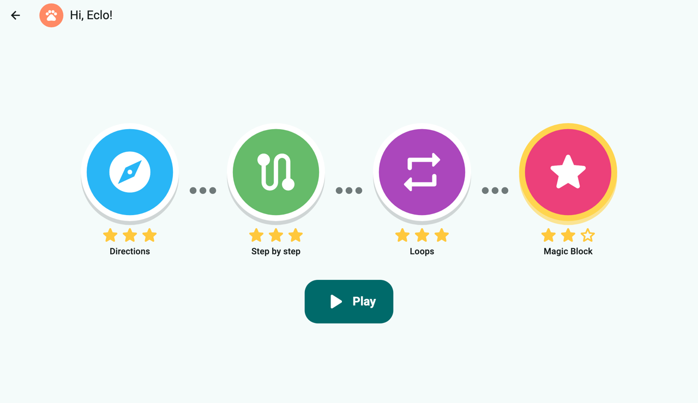<br>
      <b>Adventure map:</b> one island per idea, with stars and a sticker book.
    </td>
    <td width="50%" valign="top">
      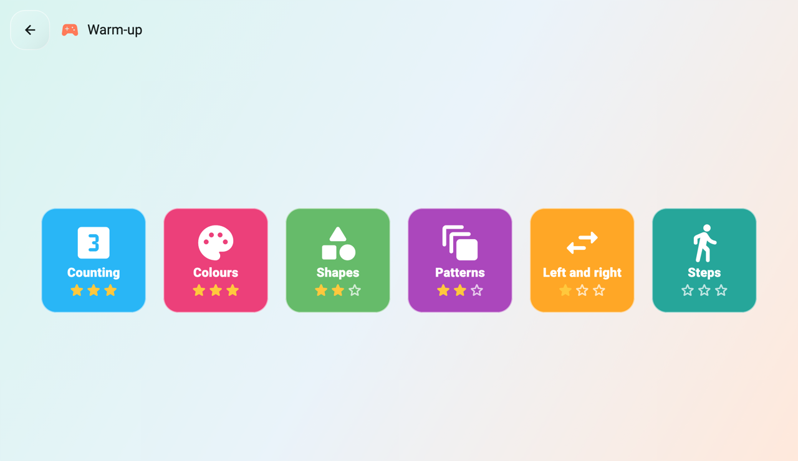<br>
      <b>Warm-up island:</b> counting, colours, shapes, patterns, left and right, and steps.
    </td>
  </tr>
  <tr>
    <td width="50%" valign="top">
      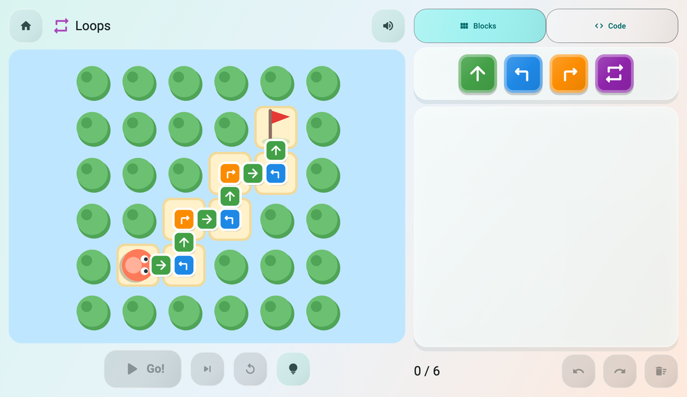<br>
      <b>Hint:</b> the level's own blocks along the route; asked again, the shape that repeats.
    </td>
    <td width="50%" valign="top">
      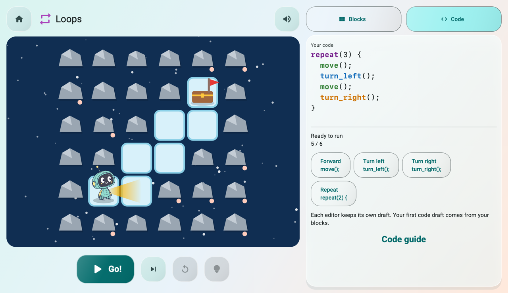<br>
      <b>Typed code:</b> readers type the program; commands share their blocks' colours.
    </td>
  </tr>
  <tr>
    <td width="50%" valign="top">
      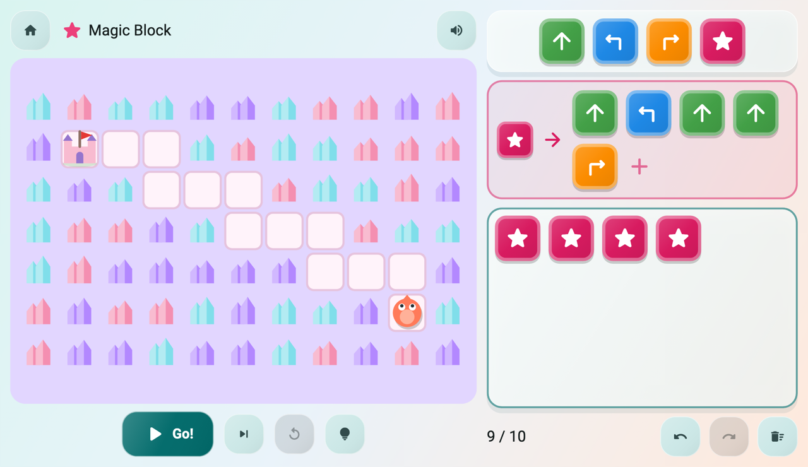<br>
      <b>Magic Block:</b> build your own block once, then use it again and again.
    </td>
    <td width="50%" valign="top">
      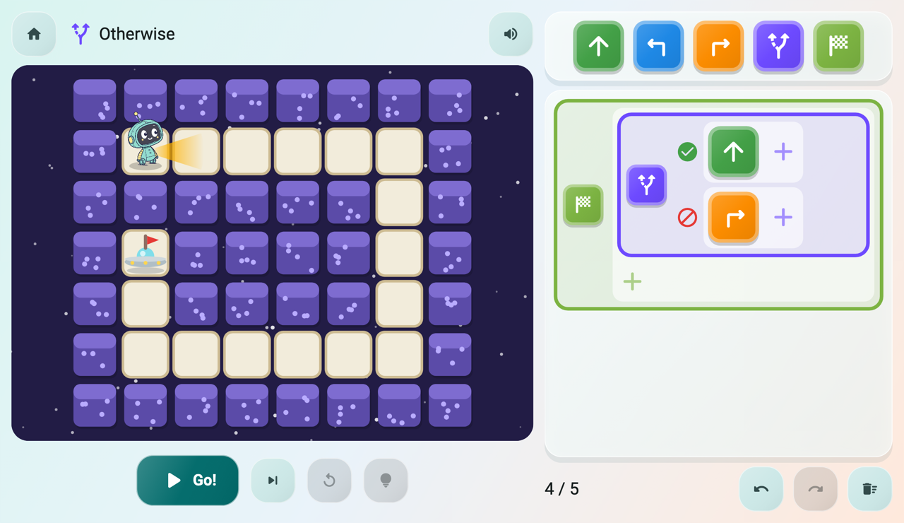<br>
      <b>Otherwise:</b> if the path is clear, step; otherwise, turn.
    </td>
  </tr>
  <tr>
    <td width="50%" valign="top">
      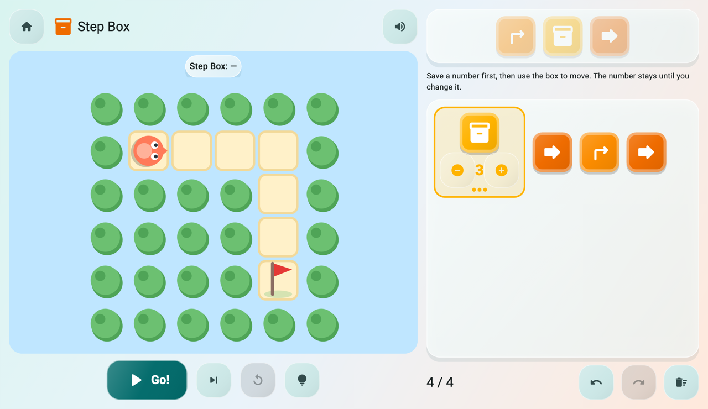<br>
      <b>Step Box:</b> save a number once and move by it.
    </td>
    <td width="50%" valign="top">
      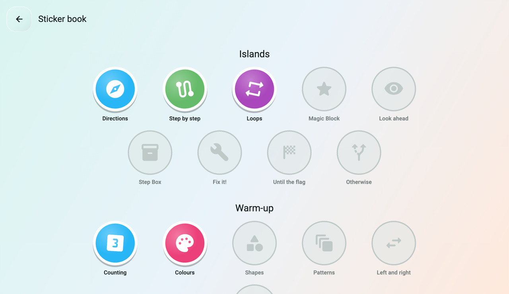<br>
      <b>Sticker book:</b> a sticker for every finished island and Warm-up game.
    </td>
  </tr>
  <tr>
    <td width="50%" valign="top">
      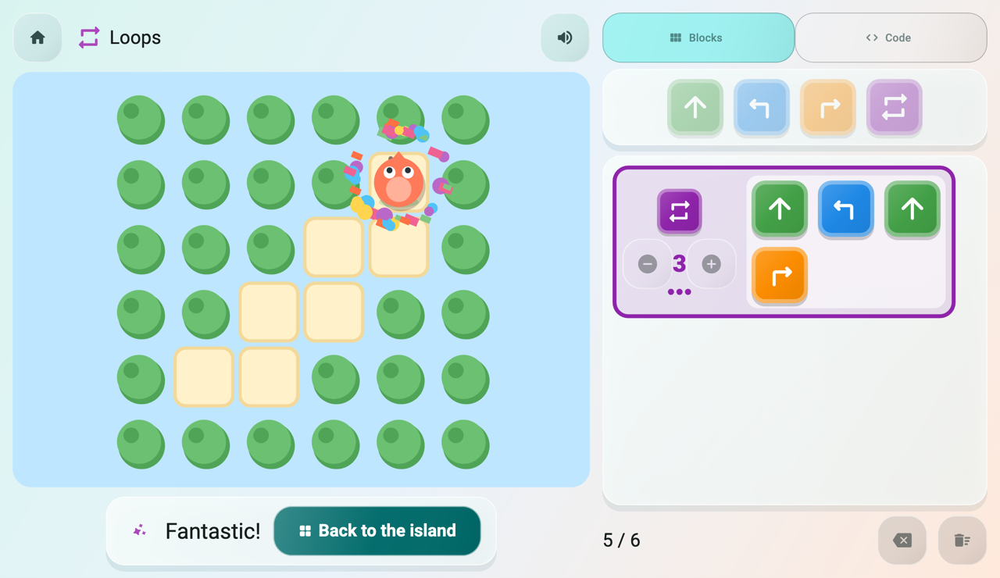<br>
      <b>Solved:</b> varied cheers, then back to the island (or the map once the island is complete).
    </td>
    <td width="50%" valign="top">
      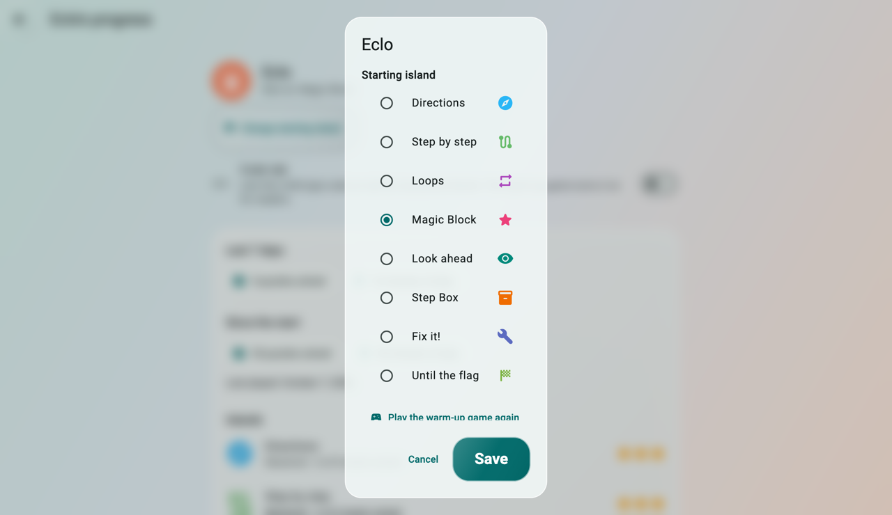<br>
      <b>Parent area:</b> behind a grown-up check; set the starting island or replay the warm-up.
    </td>
  </tr>
  <tr>
    <td width="50%" valign="top">
      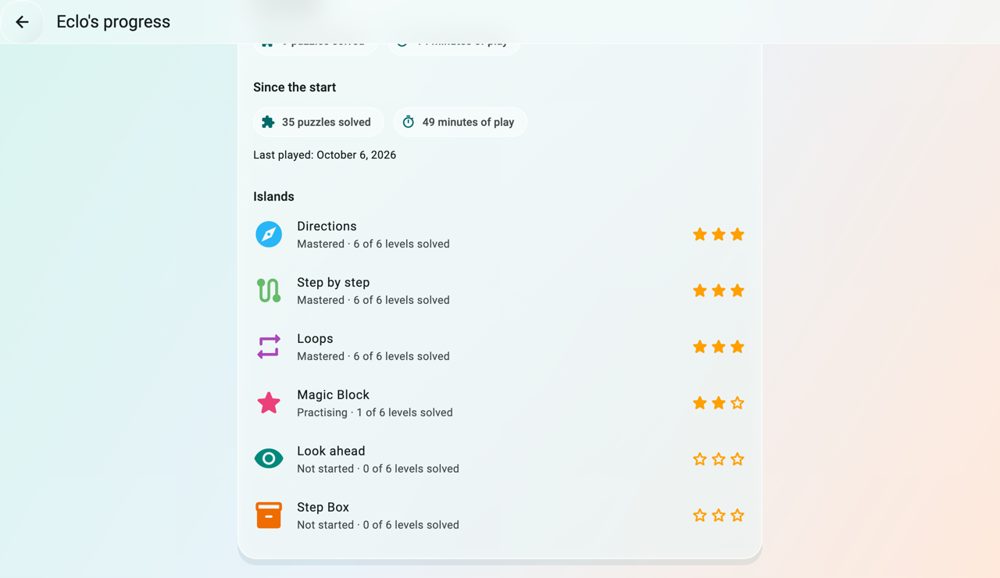<br>
      <b>Progress report:</b> (sponsor feature) puzzles, play time and every island.
    </td>
    <td width="50%" valign="top">
      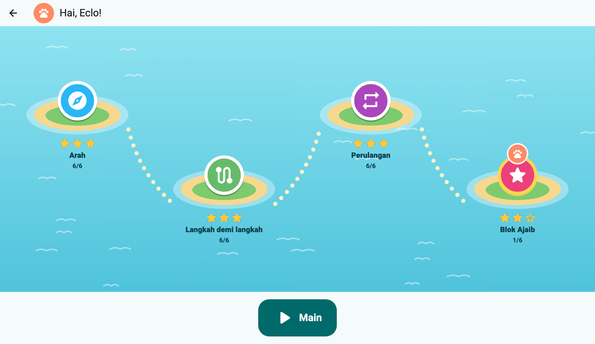<br>
      <b>Bahasa Indonesia:</b> every screen in Indonesian and English.
    </td>
  </tr>
</table>

| Item | Value |
| --- | --- |
| Package name | `cobalagi` |
| App / bundle ID | `com.ardeman.cobalagi` |
| Dart SDK | `^3.11.0` (built with Flutter 3.41.1, stable) |
| Lints | [`flutter_lints`](https://pub.dev/packages/flutter_lints) via `analysis_options.yaml` |

## Getting started

Prerequisites: the [Flutter SDK](https://docs.flutter.dev/get-started/install) on the stable channel, plus the toolchain for the platform you target (Android Studio, Xcode, etc.). Run `flutter doctor` to check.

```sh
flutter pub get
git config --local core.hooksPath .githooks
flutter run            # choose a device; or: flutter run -d chrome
```

## Commands

| Task | Command |
| --- | --- |
| Install dependencies | `flutter pub get` |
| Run (debug) | `flutter run -d <device>` |
| List devices | `flutter devices` |
| Format | `dart format .` |
| Static analysis | `flutter analyze` |
| Tests | `flutter test` |
| On-device tests (real app and audio; not part of Checks) | `flutter test integration_test -d macos` |
| Enable commit-message hook (once per clone) | `git config --local core.hooksPath .githooks` |
| Release build | `flutter build <apk\|appbundle\|ipa\|web\|macos\|linux\|windows>` |
| Installable Android APKs (one per architecture) | `flutter build apk --release --split-per-abi` |
| Publish the APKs as a GitHub Release by hand (`--dry-run` to only build; `--latest` for a full release). Pushing a version bump to `master` does this automatically (`.github/workflows/release-apks.yml`). | `tool/release_apks.sh` |

**Checks** — run all three before every commit. They must pass with no errors or warnings:

```sh
dart format --set-exit-if-changed . && flutter analyze && flutter test
```

Commit subjects must use `type(scope)!: description`, with optional scope and
`!` for breaking changes. Allowed types are `feat`, `fix`, `docs`, `style`,
`refactor`, `perf`, `test`, `build`, `ci`, `chore` and `revert`. For example:
`feat(profiles): add avatar picker`. Bodies and footers are optional.

The versioned `.githooks/commit-msg` hook rejects invalid subjects, including
default merge and revert messages; give those commits a conventional subject
such as `chore: merge feature branch` or `revert: undo avatar picker`.
Enable it after each clone using the setup command above. Local Git hooks can
be bypassed with `--no-verify`; they do not enforce remote repository policy.

## Project layout

```text
lib/
  main.dart        Opens storage, wires services, starts the app
  app/             App widget, router, theme, l10n (ARB files + generated code)
  core/            Shared services: storage, settings, entitlement, audio, responsive,
                   widgets (bounded glass panels and the ambient background)
  engine/          Pure Dart: instruction set (program/), levels (world/), interpreter, solver + puzzle generator
  learning/        Pure Dart: skill graph, mastery scoring, advance/practice/review rules
  features/        One folder per feature (profiles, adventure_map, play, editors,
                   learning, pretest, parent, splash)
test/              Mirrors lib/
integration_test/  Tests that drive the real app on a device (e.g. warm-up voice timing)
.githooks/         Versioned Git hooks for commit-message validation
tool/              Developer scripts (voice clips, screenshot renders)
branding/          App icon source (SVG), rendered PNGs and branding/render.sh
store/             Google Play listing text and graphics per language (id, en-US)
website/           Static landing page for cobalagi.ardeman.com, plus screenshots
assets/config/     skills.json (skill map), adaptive.json (learning thresholds),
                   pretest.json (placement rules and warm-up vocabulary)
                   warm_up.json (Warm-up island games and round length)
assets/levels/     Hand-made lesson packs (JSON), one per concept
assets/audio/      Voice clips per language: <id|en>/<clipId>.mp3 (see Voice-over)
android/ ios/ web/ macos/ linux/ windows/
                   Platform runners, mostly generated by Flutter
```

## Voice-over

Every clip the app plays is listed in `lib/core/audio/voice_clips.dart` with the text to record. Missing clips are skipped silently, so the app works before recording.

```sh
dart run tool/voice_script.dart id > voice_id.csv   # Indonesian script: id, file, text, status
dart run tool/voice_script.dart en > voice_en.csv   # English
```

Record each row as an MP3 at the listed path (`assets/audio/<language>/<clipId>.mp3`). Run the script again to see what is still missing.

**ElevenLabs (the chosen voices):** `tool/generate_voice.dart` makes every clip with ElevenLabs, then trims and levels it like the test voices. Shipping the clips needs an ElevenLabs plan with a commercial license (Starter or higher); the free plan is fine for auditioning.

```sh
cp .env.example .env                          # then put your key in .env (git-ignored)
dart run tool/generate_voice.dart --voices    # list voices in your account
# put the chosen voice_id for "id" and "en" in tool/elevenlabs.json
dart run tool/generate_voice.dart --sample    # 5 sample lines per language in build/voice_samples/
dart run tool/generate_voice.dart             # all clips (replaces test voices)
dart run tool/generate_voice.dart --only cheer_celebrate_1   # redo one clip
```

Model, voices and settings (`speed`, `stability`, `style`…) live in `tool/elevenlabs.json`. When the test voices are replaced, the tool removes `assets/audio/TEST_VOICES`. The shipped clips use Cahaya (Indonesian) and Jessica (English) and are committed in `assets/audio/`.

**Sound effects:** `tool/generate_sfx.dart` makes the game sounds (`SoundEffect`: step, turn, bump, star, goal, drop) with ElevenLabs' sound-effects model, from the prompts in `tool/sound_effects.json`, into `assets/audio/sfx/`. The API key needs the *Sound Effects* permission.

```sh
dart run tool/generate_sfx.dart               # missing effects
dart run tool/generate_sfx.dart --only goal   # redo one
```

**Background music:** `tool/generate_music.dart` composes the looping theme (`MusicTrack`) with ElevenLabs Music from the prompt in `tool/music.json` into `assets/audio/music/`. The API key needs the *Music* permission. Run `dart run tool/generate_music.dart --force` to compose a new one.

**Test voices (macOS):** to hear the voice flow before real recordings exist, generate every clip with the Mac's built-in voices (Damayanti for Indonesian, Flo for English):

```sh
dart run tool/test_voices.dart          # create missing clips (needs ffmpeg)
dart run tool/test_voices.dart --clean  # remove them again
```

Apple's license doesn't cover shipping these voices, so they are marked by the git-ignored `assets/audio/TEST_VOICES`, and **release builds refuse to build while that marker exists**. Don't commit clips while the marker is present; restore the real ones with `git checkout assets/audio` (or regenerate them) and run `--clean`.

After adding or replacing clips, Android builds may keep using an old asset list. Clear it with `rm -rf build/app/intermediates/flutter .dart_tool/flutter_build` (or `flutter clean`) before building.

## Release (Google Play)

1. Create an upload key once and keep it safe (never commit it):

   ```sh
   "/Applications/Android Studio.app/Contents/jbr/Contents/Home/bin/keytool" -genkey -v -keystore ~/cobalagi-upload.jks -keyalg RSA -keysize 2048 -validity 10000 -alias upload
   ```

   macOS has no system Java, so this uses the Java bundled with Android Studio. Back up the `.jks` file and its password outside this Mac; without them you can't publish updates.

2. Create `android/key.properties` (git-ignored):

   ```properties
   storeFile=/Users/<you>/cobalagi-upload.jks
   storePassword=<password>
   keyAlias=upload
   keyPassword=<password>
   ```

   Without this file, release builds are debug-signed: fine for testing, rejected by Google Play.

3. For each new build ("bump and build"), follow the checklist below.

### Bump and build checklist

1. **Version.** Raise the build number after `+` in `pubspec.yaml` by one. Pick the name from the rules in `AGENTS.md` → Version: ask whether the previous build is already live in a Google Play track. If it isn't, keep its name (`1.4.0+11` → `1.4.0+12`); if it is, raise MINOR for new features or PATCH for fixes only.
2. **Release notes.** Write `store/en-US/changelogs/<build>.txt` and `store/id/changelogs/<build>.txt` (one `- ` line per change, plain words for parents, at most 500 characters each, both saying the same), add `{ "build", "version", "date" }` to `store/releases.json`, then run `dart run tool/website_changelog.dart`.
3. **Listing text.** If a feature changes what `store/<locale>/full_description.txt` or `website/index.html` claim, update both languages.
4. **Screenshots.** Run `flutter test tool/screenshots --update-goldens`, `tool/screenshots/export.sh` and `store/render.sh`. Headless Chrome is sometimes killed mid-render (exit 137, slides deleted): run `store/render.sh` again until it exits 0 and `ls store/*/phone_screenshots/*.png store/*/screenshots/*.png | wc -l` gives 32.
5. **Drop render noise.** The solved and warm-up screens pick a random cheer and confetti, so they change on every render. If their screen didn't change, restore them: `git checkout -- 'store/*/6-solved.png' website/screenshots/solved*.png website/screenshots/phone-solved*.png website/screenshots/warm-up-pattern*.png website/screenshots/phone-warm-up*.png website/screenshots/warm-up-colors*.png website/screenshots/phone-warm-up-colors*.png`. Look at every other changed slide before keeping it.
6. **Checks and builds.** Run the Checks, then `flutter build appbundle --release` (for Play) and `flutter build apk --release --split-per-abi`.
7. **Tell the user what to upload:** the bundle path, the release notes, and which store slides and texts changed since the last upload (`git diff --stat <last build commit> -- store/`), marking slides that only changed slightly as optional.
8. **Commit and push only when asked**, as two commits: the feature work (`feat:`/`fix:`), then `build: bump version to <name>+<build>` with `pubspec.yaml`, `store/` and `website/`. Pushing the version change publishes the APKs to GitHub Releases; watch it with `gh run watch $(gh run list --workflow release-apks.yml --limit 1 --json databaseId --jq '.[0].databaseId') --exit-status`.

### Checking UI changes

- **Renders:** `flutter test tool/screenshots --update-goldens --plain-name '<test>'` (for example `'tablet en map'`) draws a screen into `tool/screenshots/out/`. For a screen without a test, add a temporary `testWidgets` there, look at the image, then remove the test and its `out/*tmp-*` images. Renders draw plain blurs, not liquid-glass shaders.
- **Emulators** (AVDs `Pixel_9a`, `Redmi_Pad_2`): start one with `~/Library/Android/sdk/emulator/emulator -avd <name> &`, drive the app from a temporary test in `integration_test/` with `flutter test integration_test/<file> -d emulator-5554`, print a marker at each step, and grab `adb exec-out screencap -p` when it appears. The emulator's own rotation is unreliable: set orientation inside the test with `SystemChrome.setPreferredOrientations`. Delete the temporary test afterwards.

**Play Console:**

- **Donations:** create one-time in-app products whose ids match `assets/config/donations.json` (`supporter_small`, `supporter_medium`, `supporter_large`), with prices of your choice. Any of them unlocks the sponsor plan. Test with license testers.
- **Families policy:** target audience is children, with no ads and no data collection. The release build has no internet permission. Privacy policy URL: `https://cobalagi.ardeman.com/privacy.html`.

## Launch updates

On Android, the splash checks Google Play for an available update for up to two
seconds. If one is available, the notice offers continuing to play or asking a
parent to update. The update action requires the parent gate; Google Play handles
the download and installation. Unavailable stores, offline devices and slow
checks continue to play without a notice. iOS, web and desktop skip the check.

Use a Google Play test track to verify the real update flow: install an older
build from Play with the test account, then make a higher version code available
to that account. Direct APK installs do not have a separate update source. See
[Google's in-app update testing guide](https://developer.android.com/guide/playcore/in-app-updates/test).

## macOS

```sh
flutter build macos --release   # → build/macos/Build/Products/Release/Coba Lagi.app
```

- Needs macOS 12 or later, Xcode and CocoaPods. The window opens at 1280 × 800 and can't shrink below 960 × 600.
- **Apple Silicon only (`ARCHS = arm64`).** Xcode 27's `lipo -verify_arch` accepts one architecture per call, which breaks Flutter 3.41's universal-build check. Remove `ARCHS = arm64` from `macos/Runner.xcodeproj` once Flutter handles it, to bring back Intel Macs.
- **Not distributed for now:** developers build and run it themselves (`open "build/macos/Build/Products/Release/Coba Lagi.app"`). The build is ad-hoc signed, so it runs only on the Mac that built it. Distributing it later needs an Apple Developer account (Developer ID signing and notarization, or the Mac App Store).
- Donations are off on macOS (free plan only); the store is wired up for Android and iOS.

## Website

`website/` is published to [cobalagi.ardeman.com](https://cobalagi.ardeman.com) by GitHub Pages. `.github/workflows/pages.yml` deploys it on every push to `master` that changes `website/`, and can also be run by hand from the Actions tab. Preview locally with `open website/index.html`; add `?lang=en` or `?lang=id` to pick a language.

One-time setup (already done for this repo): Pages source **GitHub Actions**, custom domain `cobalagi.ardeman.com` (also in `website/CNAME`), and a DNS `CNAME` record `cobalagi` → `ardeman.github.io`.

## App icon

The icon (coral character on teal) is drawn in `branding/icon.svg`, with a one-colour version for Android 13 themed icons in `branding/icon_monochrome.svg`. After editing either, run `branding/render.sh`: it renders the PNGs with headless Chrome and generates every platform's icons with `flutter_launcher_icons` (config: `flutter_launcher_icons.yaml`). `branding/play_store_icon.png` is the 512 × 512 icon for the Play Console.

## Store listing

`store/<locale>/` holds the Google Play listing for Indonesian (`id`) and English (`en-US`): `title.txt` (max 30 characters), `short_description.txt` (max 80), `full_description.txt` (max 4,000) and `changelogs/<versionCode>.txt` with each build's release notes (max 500), plus `feature_graphic.png` (1024 × 500), `screenshots/` (1920 × 1080, 16:9) for the 7-inch and 10-inch tablet sections and `phone_screenshots/` (1080 × 1920, 9:16) for the phone section. The app icon for the listing is `branding/play_store_icon.png`.

`flutter test tool/screenshots --update-goldens && tool/screenshots/export.sh` renders every screenshot from the real app with sample data into `website/screenshots/`, in Indonesian and English. Tablet and phone store sets each contain eight slides: the map, Loops, typed code, Magic Block, Fix it!, a solved puzzle, Until the flag, and the parent controls with the progress report. `store/render.sh` then re-renders the graphics from `website/screenshots/` and the icon art. Promo videos show real gameplay from the "Watch me!" demos. Record its frames once (about 15 minutes) with `VIDEO_FRAMES=1 flutter test tool/screenshots --update-goldens --plain-name 'video frames'`, then `tool/marketing/invite_video.sh` renders the vertical closed-test invites (1080 × 1920) and `tool/marketing/promo_video.sh` the landscape YouTube and store-listing promo (1920 × 1080), in Indonesian and English, into `build/marketing/`. `dart run tool/website_changelog.dart` rebuilds the website's release notes page (`website/changelog.html`) from `store/releases.json` and the store changelogs. Play doesn't allow ranking or promotional words ("best", "#1", "new", "sale"), calls to action or emoji in the listing.

## Roadmap (MVP)

| Phase | Scope |
| --- | --- |
| 0. Foundation ✅ | Packages, theme, Indonesian/English, routing, local storage, responsive layout, audio, profiles, parent gate, free/full plan check |
| 1. Engine ✅ | Instruction set, world, interpreter, level JSON, solver (unit-tested, no UI) |
| 2. Play + picture blocks ✅ | Flame world with placeholder shapes, icon-block editor, run/step/reset, Directions and Sequencing levels |
| 3. Learning loop ✅ | Attempt tracking, mastery, advance/practice/review, generated variations, Loops levels, adventure map |
| 4. Pretest ✅ | Reading check and pre-skills, voice-led and adaptive; placement; parent override |
| 5. Hardening ✅ (code) | Donations through Google Play Billing (any donation unlocks sponsor features), release config, voice clips, tablet performance |
| 6. After MVP ✅ | Magic Block island (own block), parent progress report, sound effects and music, splash, how-to hint, warm-up second chance |
| 7. Conditions ✅ | Look Ahead island, six lessons, generated practice and an eye block that runs its contents only when the cell ahead is clear |
| 8. Typed code ✅ | Switch between blocks and code on every island, command buttons, line feedback and step highlighting, with the same engine and lesson limits |
| 9. Variables ✅ | Step Box island, six lessons, generated practice, stored-distance blocks and typed assignments |
| 10. Otherwise ✅ | Otherwise island (if / else): the eye block gets a second row for a blocked path, in a hedge maze; six lessons, generated wall-following practice, typed `if_path_clear { } otherwise { }` |

The eye block checks once before running its contents. Put a forward block
inside it to move safely; put the eye block inside a repeat to check again
on every turn of the loop. Tap a repeat or eye block, then a palette block
to fill it, or drag blocks into it. Checks appear as green (clear) or orange
(blocked) rings in the world. The Conditions island follows Magic Block.

The Code button opens a small teaching language. The first code draft is
copied from the current blocks; each editor then keeps its own draft for the
current puzzle. Commands use the same names in both app languages:

```text
define star {
  move();
  turn_right();
}
repeat(3) {
  if_path_clear {
    move();
  }
}
star();
```

Actions end with `();`. Repeats take counts from 1 to 9, and `//` starts a
comment. `turn_left();` turns left. Command buttons offer only the current
lesson's palette. The parser compiles to `Program` with source IDs; the shared
validator checks the palette, block limit, empty bodies and recursive calls.
Run and Step use the same interpreter as blocks. Editing and switching put the
world back at the start. On phones, the code editor fills the space while the
keyboard is open. Commands are coloured like their blocks (`colouredCode`), so
a child can match a line of code to the block it came from.

On phones (portrait), the world and the editor scroll as one page under a
glass top bar, which holds the Blocks/Code switch for readers, and glass controls (Go and
its buttons) at the bottom; the bars frost only while content is under them.
Phones held sideways (under 500 dp tall) keep the world and Go on the left and
scroll the editor on its own on the right, with the same small blocks; the
adventure map puts the islands in one row that scrolls sideways, starting at the current island; the warm-up game shrinks its pictures to fit the height and puts the question's
picture beside the answers. Tablets held upright use the stacked phone page
with a large world. A new block scrolls into view; Go and Step scroll back to the world
so the child watches the run.

Once every lesson on an island is solved, practice puzzles lead on to the
next island: after a solved puzzle at the practice mastery level, or after
`practiceLimit` exercises at most (`assets/config/adaptive.json`). The island
screen shows how many puzzles remain as a dotted trail to the next island's
emblem (`LearningEngine.puzzlesToMoveOn`). When a child moves on, play returns
to the map, where the new island grows in as its cloud and lock lift off
(`LearningState.islandToCelebrate`, cleared by `celebrated`); it holds still
when the system asks for fewer animations. Dropping a block gives a light
haptic tick on devices that have one.

The Warm-up island comes first on the map and is always open. It keeps the
warm-up game's picture questions for the youngest players, plus colours and
shapes, as separate games (`WarmUpGame` in `lib/learning/warm_up/`): counting,
colours, shapes, patterns, left and right, and steps. A round
(`roundLength` questions in `assets/config/warm_up.json`) starts at the
child's best level, goes up a level after a right answer and down after a
wrong one. Each game's stars are its best level; the island's stars are their
average. Warm-up games never change the coding path. To add a game, add a
`WarmUpGame` value with its question type, prompt text and voice clips, then
list it in `warm_up.json`.

The sticker book (the book button on the map, with a badge for new
stickers) holds a sticker for every coding island whose lessons are all
solved and every Warm-up game at three stars (`lib/learning/stickers.dart`).
Stickers are worked out from progress; only the ones already seen are saved,
so new ones pop in once.

Parents can set a break reminder (off, 15, 30 or 45 minutes of puzzle time; `PlayClock` pauses in the background). When it is due, the current puzzle finishes, then a "Time for a break!" screen comes before the next one; only a grown-up (parent gate) continues, which resets the time.

Every island opens with a "Watch me!" demo on a child's first visit: a voice explains the idea while a hand places blocks in the real editor and presses Go in the real world. Children watch, then press "Let's play!" (or Skip); "Watch how" on each island plays it again. Demos are scripts in `assets/config/tutorials.json` (a small level plus actions: add a block, set a count, pick and replace, press Go), with narration clips `tutorial_<concept>`; `test/features/tutorial/tutorial_test.dart` checks every island has one that ends solved. Seen demos are saved per child (`LearnerState.tutorialsSeen`).

Fix it! (debugging) follows the Step Box. Its puzzles open with blocks already placed that have one bug: a turn the wrong way, a step missing or one too many, a repeat count off by one, or a wrong turn inside the Magic Block. The child runs the program, watches where it goes off course and fixes it; every lesson is fixable with one change (`test/features/play/level_assets_test.dart`). Generated practice plants one bug in a verified Step-by-step or Loops solution. Lessons store the starter program in the level JSON (`"starter"`, see `lib/engine/program/program_json.dart`). Struggling children review Loops.

Until the flag (while loops) follows Fix it!. Its "repeat until the flag" block (`until_flag { … }` in code, `RepeatUntilGoal` in the engine) repeats its blocks with no count; the run ends on the flag, on a bump or at the step limit, and each round costs one step, so a loop that never moves still stops. It sits only in the main row and may hold actions and one Look Ahead check. Routes repeat a shape 3–7 times, the palette has no counted repeat, and the block limit leaves no room to write the steps out. Struggling children review Loops.

Variables follow Look Ahead on the map. The six Step Box lessons teach saving
a number, reusing it across equal-length corridors, changing it for a new
distance and collecting stars along the way. Generated practice follows the
same progression across five difficulty levels. The palette offers Save steps,
Use steps and turns; its command limit keeps the focus on stored distances.

Save steps has number buttons (1–9) and picture dots. Use steps moves the
current saved distance. In code, write `steps = 3;` then `move(steps);`.
The box starts empty on each run; using it before saving is highlighted before
execution. A save inside a conditional does not guarantee a value outside it.
The number shown in the world follows playback, including Step, and resets
when the program is edited. Both editors compile to shared `SetSteps` and
`MoveSteps` instructions; the world only displays interpreter events.

### Later

- **Rive character** (waiting on the user): the user will pick a CC BY character from the Rive community and send the `.riv` file with its link (the creator is credited in the Parent area and on the website). Criteria: top-down or four-direction views (the world turns the character, so its facing must stay visible), a state machine with at least idle (walk, happy and oops are welcome), roughly square, a simple friendly style. Build it only once the file arrives: `rive`/`flame_rive`, a mapping in `assets/config/character.json` (artboard, state machine, inputs for walk, turn, bump and celebrate), the drawn character kept as a fallback, no runtime network calls, the release manifest still without INTERNET, and the dependency recorded in `AGENTS.md`.
- **Progress export and import** (parent area, behind the parent gate; a sponsor feature or for everyone, not decided): "Save progress" writes a file and opens the system share sheet, so the parent chooses where it goes (Google Drive, Files, a chat to themselves); "Load progress" on another device picks that file and merges it. The app stays without internet access and nothing leaves the device unless a parent moves it, so the privacy promises and the Families form stay as they are. Merge: union of lesson, star (best kept) and seen-puzzle data, the attempt logs combined by unique id, and the starting-island choice from the newer file. Real cloud sync (the app sending progress to the parent's Google Drive or a server) would break the "no internet, data stays on the device" promise and need a new Families review, so it is not planned.

## Documentation map

Each topic has one home. Update that file instead of copying its content somewhere else.

| File | Audience | Owns |
| --- | --- | --- |
| `README.md` | Everyone | Overview, setup, commands, layout |
| `AGENTS.md` | AI coding agents (and humans who want the rules) | Conventions, guardrails, definition of done |
| `CLAUDE.md`, `GEMINI.md` | Claude Code, Gemini CLI | Only an import of `AGENTS.md` |
| `LICENSE` | Everyone | Terms for using the code (GPL-3.0) |
| `NOTICE.md` | Everyone | Copyright, and the separate terms for sounds, art and the name |
| `website/` | Visitors of cobalagi.ardeman.com | The landing page, privacy policy and screenshots (also used by this README) |

Codex, Cursor, GitHub Copilot, Windsurf, Jules, Aider, Zed and other agents that follow the [AGENTS.md](https://agents.md) convention read `AGENTS.md` directly.

## License

The code of Coba Lagi is free software under the [GNU General Public License v3.0 or later](LICENSE): you may use, study, share and change it, and anything you distribute that is built from it must be under the GPL too, with its source. Sounds, art and listing graphics are under CC BY-NC-ND 4.0, and the name and icon are not licensed for other apps; see [NOTICE.md](NOTICE.md). Third-party packages keep their own licenses.
