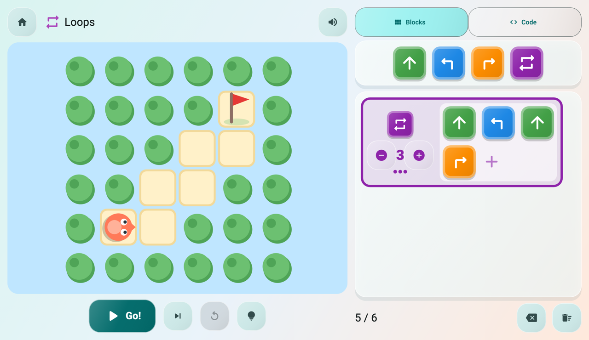
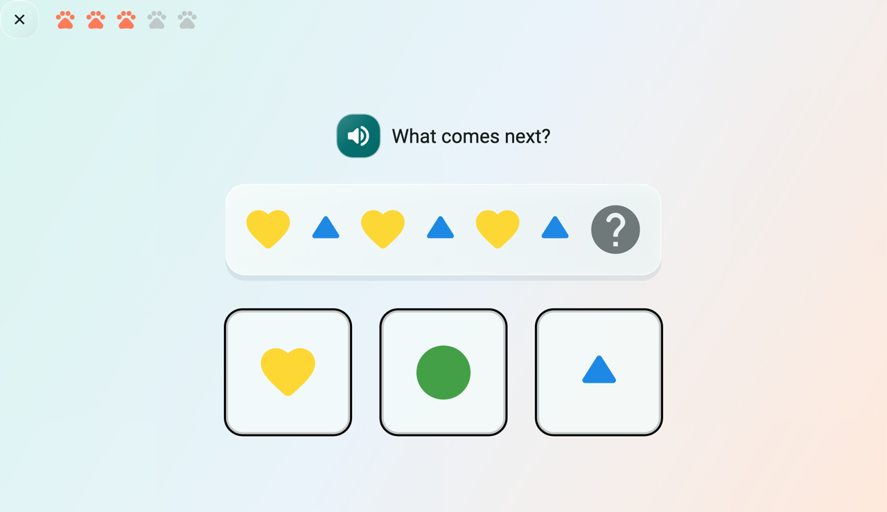

# Coba Lagi

A coding-learning app for children of all ages, in Bahasa Indonesia and English.

- **Tier 1** (pre-readers, about 4–7): icon blocks and voice instructions.
- **Tier 2** (early readers, about 7–10, planned): word blocks such as `move 3`.
- **Tier 3** (about 10–14+, planned): blocks that flip to real code, then typed code.

Every tier drives the same game world. A short, voice-led placement game picks each child's starting point, and the app then chooses to advance, practise or review after every lesson.

Primary target: Android tablets in landscape. The code stays compatible with iOS, web and desktop, but only Google Play releases are planned for now.

> **Status:** the MVP code is complete (phases 0–5, see the roadmap). Still needed before launch: voice recordings, an app icon and artwork, and Play Console setup.

Website: [cobalagi.ardeman.com](https://cobalagi.ardeman.com) (source in `website/`).

## Screenshots

| | |
| --- | --- |
|  |  |
| **Adventure map:** one island per concept, with stars for mastery. | **Loops puzzle:** a repeat block, the block limit, and a hint showing the route. |
|  |  |
| **Solved:** varied cheers, then the next puzzle chosen by the learning rules. | **Warm-up game:** picture-based, voice-led placement for children who can't read yet. |
|  |  |
| **Parent area:** behind a grown-up check; set the starting island or replay the warm-up. | **Bahasa Indonesia:** every screen in Indonesian and English. |

| | |
| --- | --- |
| Package name | `cobalagi` |
| App / bundle ID | `com.ardeman.cobalagi` |
| Dart SDK | `^3.11.0` (built with Flutter 3.41.1, stable) |
| Lints | [`flutter_lints`](https://pub.dev/packages/flutter_lints) via `analysis_options.yaml` |

## Getting started

Prerequisites: the [Flutter SDK](https://docs.flutter.dev/get-started/install) on the stable channel, plus the toolchain for the platform you target (Android Studio, Xcode, etc.). Run `flutter doctor` to check.

```sh
flutter pub get
git config --local core.hooksPath .githooks
flutter run            # choose a device; or: flutter run -d chrome
```

## Commands

| Task | Command |
| --- | --- |
| Install dependencies | `flutter pub get` |
| Run (debug) | `flutter run -d <device>` |
| List devices | `flutter devices` |
| Format | `dart format .` |
| Static analysis | `flutter analyze` |
| Tests | `flutter test` |
| Enable commit-message hook (once per clone) | `git config --local core.hooksPath .githooks` |
| Release build | `flutter build <apk\|appbundle\|ipa\|web\|macos\|linux\|windows>` |

**Checks** — run all three before every commit. They must pass with no errors or warnings:

```sh
dart format --set-exit-if-changed . && flutter analyze && flutter test
```

Commit subjects must use `type(scope)!: description`, with optional scope and
`!` for breaking changes. Allowed types are `feat`, `fix`, `docs`, `style`,
`refactor`, `perf`, `test`, `build`, `ci`, `chore` and `revert`. For example:
`feat(profiles): add avatar picker`. Bodies and footers are optional.

The versioned `.githooks/commit-msg` hook rejects invalid subjects, including
default merge and revert messages; give those commits a conventional subject
such as `chore: merge feature branch` or `revert: undo avatar picker`.
Enable it after each clone using the setup command above. Local Git hooks can
be bypassed with `--no-verify`; they do not enforce remote repository policy.

## Project layout

```text
lib/
  main.dart        Opens storage, wires services, starts the app
  app/             App widget, router, theme, l10n (ARB files + generated code)
  core/            Shared services: storage, settings, entitlement, audio, responsive
  engine/          Pure Dart: instruction set (program/), levels (world/), interpreter, solver + puzzle generator
  learning/        Pure Dart: skill graph, mastery scoring, advance/practice/review rules
  features/        One folder per feature (profiles, adventure_map, play, editors,
                   learning, pretest, parent)
test/              Mirrors lib/
.githooks/         Versioned Git hooks for commit-message validation
tool/              Developer scripts (voice-over recording script)
website/           Static landing page for cobalagi.ardeman.com, plus screenshots
assets/config/     skills.json (skill map), adaptive.json (learning thresholds),
                   pretest.json (placement rules and warm-up vocabulary)
assets/levels/     Hand-made lesson packs (JSON), one per concept
assets/audio/      Voice clips per language: <id|en>/<clipId>.mp3 (see Voice-over)
android/ ios/ web/ macos/ linux/ windows/
                   Platform runners, mostly generated by Flutter
```

## Voice-over

Every clip the app plays is listed in `lib/core/audio/voice_clips.dart` with the text to record. Missing clips are skipped silently, so the app works before recording.

```sh
dart run tool/voice_script.dart id > voice_id.csv   # Indonesian script: id, file, text, status
dart run tool/voice_script.dart en > voice_en.csv   # English
```

Record each row as an MP3 at the listed path (`assets/audio/<language>/<clipId>.mp3`). Run the script again to see what is still missing.

## Release (Google Play)

1. Create an upload key once and keep it safe (never commit it):

   ```sh
   keytool -genkey -v -keystore ~/cobalagi-upload.jks -keyalg RSA -keysize 2048 -validity 10000 -alias upload
   ```

2. Create `android/key.properties` (git-ignored):

   ```properties
   storeFile=/Users/<you>/cobalagi-upload.jks
   storePassword=<password>
   keyAlias=upload
   keyPassword=<password>
   ```

   Without this file, release builds are debug-signed: fine for testing, rejected by Google Play.

3. Bump `version:` in `pubspec.yaml`, then build the bundle to upload:

   ```sh
   flutter build appbundle --release
   ```

**Play Console:**

- **Donations:** create one-time in-app products whose ids match `assets/config/donations.json` (`supporter_small`, `supporter_medium`, `supporter_large`), with prices of your choice. Any of them unlocks the supporter plan. Test with license testers.
- **Families policy:** target audience is children, with no ads and no data collection. The release build has no internet permission. Privacy policy URL: `https://cobalagi.ardeman.com/privacy.html`.

## Roadmap (MVP)

| Phase | Scope |
| --- | --- |
| 0. Foundation ✅ | Packages, theme, Indonesian/English, routing, local storage, responsive layout, audio, profiles, parent gate, free/full plan check |
| 1. Engine ✅ | Instruction set, world, interpreter, level JSON, solver (unit-tested, no UI) |
| 2. Play + Tier 1 ✅ | Flame world with placeholder shapes, icon-block editor, run/step/reset, Directions and Sequencing levels |
| 3. Learning loop ✅ | Attempt tracking, mastery, advance/practice/review, generated variations, Loops levels, adventure map |
| 4. Pretest ✅ | Reading check and pre-skills, voice-led and adaptive; placement; parent override |
| 5. Hardening ✅ (code) | Donations through Google Play Billing (any donation unlocks supporter features), release config, voice clips, tablet performance |

Later: Rive characters, Tiers 2 and 3, conditions, variables, functions.

## Documentation map

Each topic has one home. Update that file instead of copying its content somewhere else.

| File | Audience | Owns |
| --- | --- | --- |
| `README.md` | Everyone | Overview, setup, commands, layout |
| `AGENTS.md` | AI coding agents (and humans who want the rules) | Conventions, guardrails, definition of done |
| `CLAUDE.md`, `GEMINI.md` | Claude Code, Gemini CLI | Only an import of `AGENTS.md` |
| `LICENSE.md` | Everyone | Terms for using the code (PolyForm Noncommercial 1.0.0) |
| `website/` | Visitors of cobalagi.ardeman.com | The landing page, privacy policy and screenshots (also used by this README) |

Codex, Cursor, GitHub Copilot, Windsurf, Jules, Aider, Zed and other agents that follow the [AGENTS.md](https://agents.md) convention read `AGENTS.md` directly.

## License

Coba Lagi is source-available under the [PolyForm Noncommercial License 1.0.0](LICENSE.md): you may read, learn from and modify it for noncommercial purposes. Commercial use needs permission from Ardeman. Third-party packages keep their own licenses.
